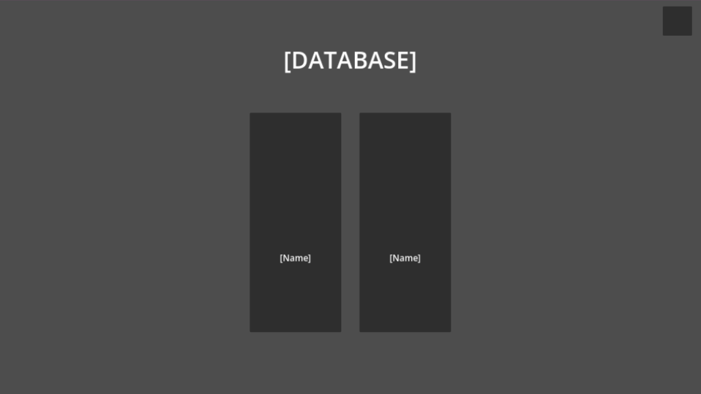
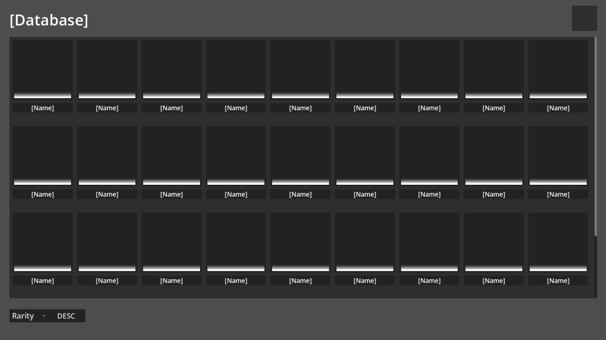
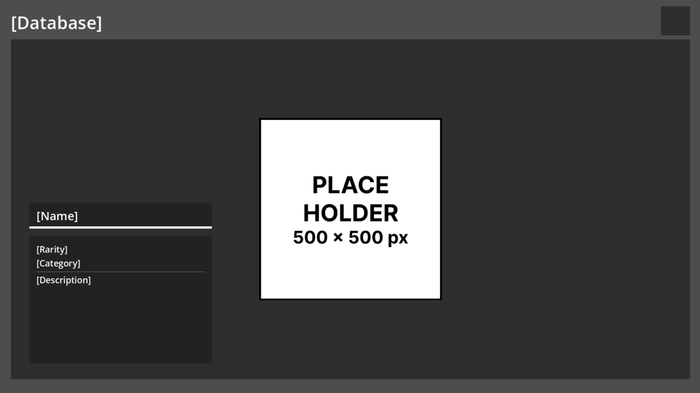
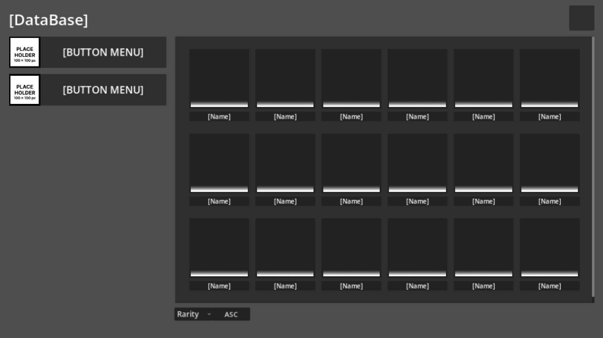
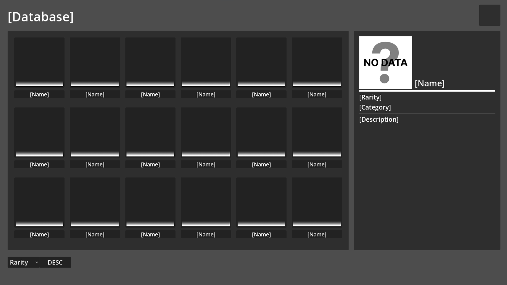

# Database Item Godot 4.6

This is a simple project to show database items in game with any UI theme, I use Godot 4.6 to make it and I really know this project is far from perfect 

There are 3 various Flows :
- Flow 1 : Menu, Preview, Detail
- Flow 2 : Menu, Preview and Detail
- Flow 3 : Menu and preview, Detail

*see the image

In this project, I use a Dictionary to store the data and save it as a resource file .tres. I added Filter and Sort Function in this project to easier to find specific items.

This is the structure :
| id | name (str) | rarity (int) | description (str) | image (str_uid) | image_preview (str_uid) |
|:---|----|---|---|---|---:|
| 1 | Tidak Aseli | 4 | Digunakan untuk menjelaskan sesuatu yang tidak nyata | uid://dt7g0y5wvpbvi | uid://bfq2xe55tcli2 |
|2 | Bukankah ini istri gue | 5 | Digunakan oleh karbit ketika melihat cewek anime/cosplayer/cantik | uid://coa7xrgvvn3sc | uid://btsgi8fumsj13 |

### Menu

### Preview

### Detail

### Menu and Preview

### Preview and Detail

